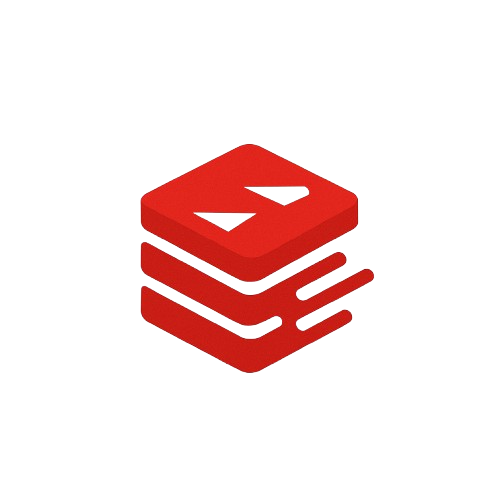

<p align="center"\>

</p\>

# VeloxDB

VeloxDB is a high-performance, in-memory database built from scratch in Go, inspired by the architecture of Redis. This project implements core Redis functionalities and data structures with a clean, modular architecture. It features full RESP protocol support and AOF data persistence, serving as a deep dive into database internals and concurrent programming in Go.

## ✅ Project Status

The project has evolved into a feature-rich, **multi-data-structure database** with a durable persistence layer and a highly modular internal architecture. Key milestones completed include:

- A generic storage engine supporting multiple data types.
- Full implementation of **String, List, Hash, and Set** data structures.
- A complete, recoverable **AOF persistence** mechanism.
- An advanced **AOF compaction** feature (`REWRITEAOF`).
- A professional, decoupled internal package structure.

The server is stable, compatible with standard Redis clients, and its extensible architecture makes adding future data structures straightforward.

## ✨ Key Features

- **Modular Architecture**: Logic is cleanly separated into distinct packages (`server`, `store`, `aof`, `resp`), promoting maintainability and testability.
- **Multi-Data Structure Support**: Natively supports Strings, Lists, Hashes, and Sets.
- **Extensible Command Dispatcher**: Uses a command table (map) instead of a large switch statement, making new command additions trivial.
- **Concurrent TCP Server**: Handles multiple clients simultaneously using a goroutine-per-connection model.
- **Full RESP Protocol Support**: A compliant parser and serializer for the Redis Serialization Protocol.
- **AOF Persistence & Recovery**: All write operations are logged to disk for durability and automatically restored on startup.
- **AOF Compaction**: Features a `REWRITEAOF` command to compact the AOF log, saving space and speeding up recovery.
- **Concurrent-Safe Generic Storage**: A thread-safe data store using `map[string]interface{}` and `RWMutex`.

## 🔧 Supported Commands

### String Commands

- **`PING`**
- **`SET key value`**
- **`GET key`**
- **`DEL key [key ...]`**

### List Commands

- **`LPUSH key value [value ...]`**
- **`RPUSH key value [value ...]`**
- **`LPOP key`**
- **`RPOP key`**
- **`LLEN key`**
- **`LINDEX key index`**
- **`LRANGE key start stop`**

### Hash Commands

- **`HSET key field value [field value ...]`**
- **`HGET key field`**
- **`HGETALL key`**
- **`HDEL key field [field ...]`**

### Set Commands

- **`SADD key member [member ...]`**
- **`SREM key member [member ...]`**
- **`SISMEMBER key member`**
- **`SMEMBERS key`**

### Server Commands

- **`REWRITEAOF`**

## ⚙️ How to Run

### Prerequisites

- Go 1.22 or later
- `redis-cli` (or another Redis client) for testing
- Docker and Docker Compose (for containerized deployment)

### Standard Execution (Local)

1.  Clone the repository:
    ```sh
    git clone https://github.com/Annany2002/velox-db
    ```
2.  Navigate to the application's entrypoint directory:
    ```sh
    cd velox-db/cmd/velox-server
    ```
3.  Run the server (the `.` tells Go to run the current package):
    ```sh
    go run .
    ```

### Running with Air (Hot Reload)

[Air](https://github.com/air-verse/air) provides live reloading for Go applications. This project includes a pre-configured `.air.toml` file for convenience.

1.  Install Air (if not already installed):
    ```sh
    go install github.com/air-verse/air@latest
    ```
2.  From the project root, run:
    ```sh
    air
    ```
    This will automatically rebuild and restart the server on code changes. The configuration in `.air.toml` ensures the correct entrypoint is used.

### Running with Docker Compose

1.  Build and start the server with Docker Compose:

    ```sh
    docker compose up --build
    ```

    This will:

    - Build the VeloxDB image
    - Expose port 6380
    - Persist the AOF file in a Docker volume at `/data/velox-db.aof`

2.  Connect using any Redis client:

    ```sh
    redis-cli -p 6380
    ```

### Running with Docker (manual)

1.  Build the Docker image:
    ```sh
    docker build -t velox-db:local .
    ```
2.  Run the container with a persistent volume:
    ```sh
    docker run -v velox-db-data:/data --name velox-db -p 6380:6380 velox-db:local
    ```

## 🧪 Testing the Server

Connect using any Redis client.

```sh
redis-cli -p 6380
```

**Example List Session:**

```
127.0.0.1:6380> RPUSH tasks "review code" "deploy feature"
(integer) 2
127.0.0.1:6380> LLEN tasks
(integer) 2
127.0.0.1:6380> LRANGE tasks 0 -1
1) "review code"
2) "deploy feature"
```

**Example Hash Session:**

```
127.0.0.1:6380> HSET user:1 name "Alice" age "30"
(integer) 2
127.0.0.1:6380> HGET user:1 name
"Alice"
127.0.0.1:6380> HGETALL user:1
1) "name"
2) "Alice"
3) "age"
4) "30"
```

**Example Set Session:**

```
127.0.0.1:6380> SADD tags "go" "redis" "docker"
(integer) 3
127.0.0.1:6380> SADD tags "go"
(integer) 0
127.0.0.1:6380> SMEMBERS tags
1) "docker"
2) "go"
3) "redis"
127.0.0.1:6380> SISMEMBER tags "java"
(integer) 0
127.0.0.1:6380> SREM tags "docker"
(integer) 1
```

## 🏗️ Architecture

The project's architecture is organized into decoupled packages, promoting a clean separation of concerns.

### File Structure

```
/velox-db
├── cmd/
│   └── velox-server/
│       └── main.go       # Application entrypoint: wires all components together.
├── internal/
│   ├── aof/
│   │   └── aof.go        # Handles AOF persistence, recovery, and rewriting.
│   ├── resp/
│   │   └── resp.go       # Handles RESP protocol parsing and serialization.
│   ├── server/
│   │   └── server.go     # Handles TCP server, connection loop, and command dispatching.
│   └── store/
│       └── store.go      # Handles the in-memory, concurrent-safe, generic data store.
├── .air.toml
├── docker-compose.yml
├── Dockerfile
└── velox-db.aof (created at runtime in /data/ when using Docker)
```

### Key Components

#### Command Dispatcher

- The server uses a **dispatch table** (`map[string]commandFunc`) to map command strings directly to their handler functions. This replaces a large `switch` statement, making the code more extensible and readable.

#### Storage Engine

- **Generic In-Memory Map**: Uses `map[string]interface{}` to store different data structures (strings, lists, etc.) under a single key space.
- **Type Assertion**: Employs runtime type checking to ensure commands operate on the correct data types, returning a `(error) WRONGTYPE` for mismatches.

#### Persistence Layer (AOF)

- **Type-Aware Rewriting**: The compaction logic inspects the type of each data structure in memory to generate the most efficient set of commands for the new AOF file (e.g., a single `SADD` for a whole set).

#### Concurrency Model

- **Goroutine per Connection**: Each client connection is handled in its own dedicated goroutine.
- **Decoupled Locking**: The `store` package manages its own `RWMutex`, ensuring data integrity without exposing locking logic to the server layer.
